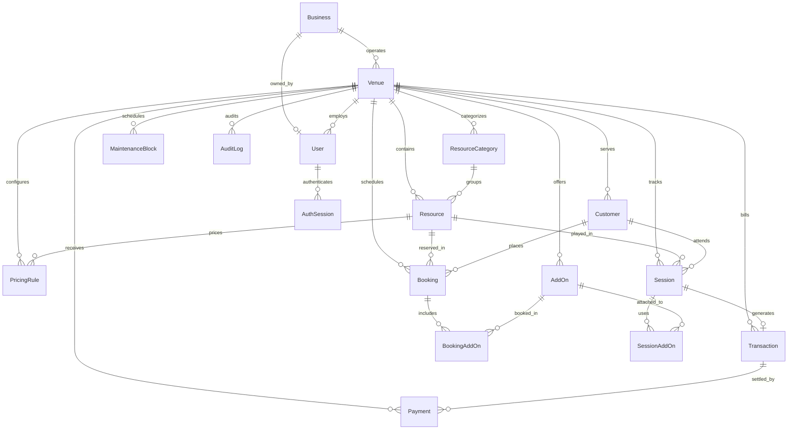

# Database Architecture & Schema Specification

The Parlour Management CRM Local MVP utilizes **Prisma ORM** coupled with a local **SQLite** database engine located at `prisma/dev.db`.

---

## 1. Environment & Storage

- **Database File**: `prisma/dev.db`
- **Datasource Connection**: `DATABASE_URL="file:./dev.db"`
- **Driver**: Prisma SQLite native engine.
- **Zero Cloud Requirement**: The database runs 100% locally on the host filesystem.

---

## 2. Entity Relationship Diagram (ERD)



---

## 3. Schema Entities & Core Fields

### 1. `Business` (Parent Brand / Legal Entity)
- `id`: Unique identifier (`cuid`).
- `name`: Business name (e.g. *"Cue Club"*).
- `displayName`: Formatted branding display name.
- `ownerId`: Relation to `User` (Owner).
- `phone`, `email`, `website`: Contact details.
- `venues`: Relation to child branches (`Venue[]`).

### 2. `Venue` (Branch / Physical Parlour Location)
- `id`: Unique branch identifier (`seed-a`, `seed-b`, or `cuid`).
- `businessId`: Parent business relation.
- `name`: Branch name (e.g. *"Cue Club — Branch 1"*).
- `shortName`: Short indicator (e.g. *"Branch 1"*).
- `address`, `city`, `state`, `pincode`: Geographic address.
- `openingTime`, `closingTime`: Operating hours (e.g. `10:00` to `02:00`).
- `currency`: Default `INR`.
- `primaryColor`, `secondaryColor`: Venue branding accents.
- `coverImageUrl`, `dashboardHeroUrl`: Venue visual hero assets.

### 3. `User` (System Accounts)
- `id`, `name`, `email`, `phone`.
- `role`: `SUPER_ADMIN` | `OWNER` | `MANAGER` | `RECEPTIONIST` | `STAFF`.
- `venueId`: Nullable; `null` for platform Super Admin, populated for venue-scoped staff.
- `passwordHash`: Salted bcrypt hash; never returned to frontend.

### 4. `Customer` (CRM Records)
- `venueId`: Tenant isolation key.
- `name`, `phone`: Customer contact details.
- `totalVisits`: Incremented atomically on session completion.
- `totalSpending`: Cumulative revenue attributed to customer.
- `lastVisitAt`: Timestamp of latest visit.
- `@@unique([venueId, phone])`: Enforces phone uniqueness per venue.

### 5. `ResourceCategory` & `Resource`
- `ResourceCategory`: Category grouping (e.g. *"Snooker"*, *"PlayStation 5"*, *"Gaming PC"*, *"Pool"*).
- `Resource`: Physical recreational unit (`status: AVAILABLE | OCCUPIED | MAINTENANCE | DISABLED`).
- `PricingRule`: Hourly rate configuration linked to resource or category.

### 6. `AddOn`, `SessionAddOn` & `BookingAddOn`
- `AddOn`: Generic amenity or service (e.g. Extra Controller, VR Headset, Snack Combo).
- `pricingType`: `PER_HOUR` | `PER_SESSION` | `PER_PERSON` | `FIXED_CHARGE`.
- `price`: Unit charge.
- `SessionAddOn`: Many-to-many relationship tracking active add-on quantities and pricing snapshot during live sessions.
- `BookingAddOn`: Add-ons selected in advance bookings.

### 7. `Booking` & `Session`
- `partySize`: Number of players (default `1`).
- `groupMembers`: Optional companion names string.
- `plannedStartAt`, `plannedEndAt`, `plannedDurationMinutes`: Original reserved duration.
- `actualStartAt`, `actualEndAt`, `actualDurationMinutes`: Measured usage duration.
- `bookedAmount`: Calculated quote at booking time.
- `actualAmount`, `finalAmount`: Billed usage total.
- `completionStatus`: `COMPLETED_AS_BOOKED` | `ENDED_EARLY` | `EXTENDED` | `RAN_OVER`.
- `extensionHistory`: JSON audit log of all time extensions granted.

### 8. `Transaction` & `Payment`
- `Transaction`: Invoice record (`subtotal`, `discount`, `tax`, `total`).
- `Payment`: Atomic settlement (`amount`, `method: CASH | UPI | CARD | OTHER`, `status: PAID`).
- Split payments are completely removed for operational speed.

---

## 4. Maintenance Commands

```bash
# Push schema changes to SQLite dev.db
pnpm db:push

# Generate Prisma Client
pnpm prisma generate

# Reset and seed clean starter database (0 fake data)
pnpm db:reset

# Launch Prisma Studio web GUI
pnpm prisma studio
```
